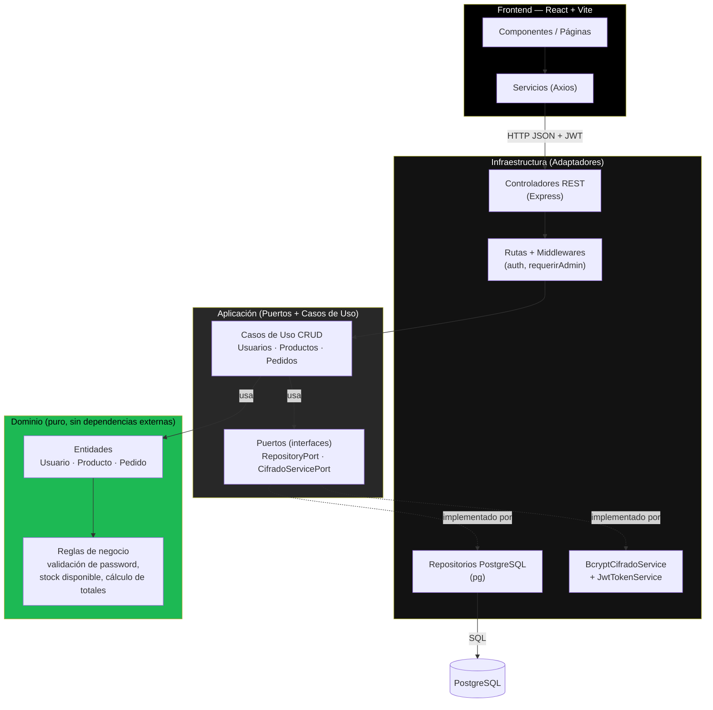

# Sistema de comercio electrónico — Backend hexagonal (PostgreSQL) + SPA "Spotify UI"

Full-stack completo y conectado de extremo a extremo:

- **Base de datos**: PostgreSQL con integridad referencial (Foreign Keys, checks, triggers de `updated_at`).
- **Backend**: Node.js en JavaScript puro (CommonJS), arquitectura hexagonal real
  (Dominio → Aplicación → Infraestructura), Express, driver `pg` y `bcryptjs`.
  CRUD completo para las 3 entidades: **Usuarios, Productos y Pedidos**.
- **Frontend**: SPA en React (Vite) + Tailwind CSS, consumiendo la API real vía Axios,
  con look & feel de la app de escritorio de Spotify.

---

## 1. Árbol de carpetas — dónde va cada bloque de código

```
ecommerce-project/
├── database/
│   └── schema.sql                         # Script PostgreSQL: tablas, FKs, checks, triggers, seed
│
├── backend/
│   ├── package.json
│   ├── .env.example
│   └── src/
│       ├── domain/                        # CAPA DE DOMINIO (sin frameworks ni driver de BD)
│       │   ├── entities/
│       │   │   ├── Usuario.js             # Validación de email y política de password
│       │   │   ├── Producto.js            # Validación y verificación de stock disponible
│       │   │   └── Pedido.js              # PedidoItem + cálculo automático del monto total
│       │   └── errors/DomainError.js
│       │
│       ├── application/                   # CAPA DE APLICACIÓN (puertos + casos de uso CRUD)
│       │   ├── ports/
│       │   │   ├── repositories.js        # Contratos Usuario/Producto/PedidoRepositoryPort
│       │   │   └── CifradoService.js      # Contratos CifradoServicePort, TokenServicePort
│       │   └── useCases/
│       │       ├── usuarioUseCases.js     # RegisterUser, LoginUser, GetUserProfile, ListUsers, UpdateUser, DeleteUser
│       │       ├── productoUseCases.js    # GetProductCatalog, CreateProduct, UpdateProduct, DeleteProduct
│       │       └── pedidoUseCases.js      # CreateOrderWithStockCheck, GetOrderHistory, ListAllOrders, UpdateOrderStatus, CancelOrder, DeleteOrder
│       │
│       ├── infrastructure/                # CAPA DE INFRAESTRUCTURA (adaptadores)
│       │   ├── db/pgConnection.js         # Pool `pg` (PostgreSQL)
│       │   ├── repositories/              # Implementan los puertos con SQL real
│       │   │   ├── PgUsuarioRepository.js
│       │   │   ├── PgProductoRepository.js    # incluye descontarStockAtomico / incrementarStock
│       │   │   └── PgPedidoRepository.js       # incluye transacción real (BEGIN/COMMIT/ROLLBACK)
│       │   ├── security/BcryptCifradoService.js  # bcryptjs + JWT
│       │   └── http/
│       │       ├── app.js                 # Composition root: ensambla TODAS las capas
│       │       ├── middlewares/authMiddleware.js
│       │       ├── controllers/
│       │       │   ├── authController.js      # registro, login, perfil
│       │       │   ├── usuarioController.js   # CRUD admin de usuarios
│       │       │   ├── productoController.js  # CRUD de productos
│       │       │   └── pedidoController.js    # crear, historial, admin, estado, cancelar, eliminar
│       │       └── routes/
│       │           ├── authRoutes.js
│       │           ├── usuarioRoutes.js
│       │           ├── productoRoutes.js
│       │           └── pedidoRoutes.js
│       └── server.js                      # Arranca Express
│
└── frontend/
    ├── package.json
    ├── vite.config.js
    ├── tailwind.config.js                 # Paleta Spotify (negro #000000 / gris #121212 / verde #1db954)
    ├── postcss.config.js
    ├── index.html
    └── src/
        ├── main.jsx
        ├── App.jsx                        # Rutas + layout (Sidebar / contenido / DetailPanel / BottomBar)
        ├── index.css
        ├── services/                      # Adaptadores de red (Axios) — 100% conectados al backend
        │   ├── api.js                     # instancia Axios con interceptor de token
        │   ├── authService.js             # registro, login, obtenerPerfil
        │   ├── productoService.js         # listar, crear, actualizar, eliminar
        │   ├── pedidoService.js           # crear, historial, listarTodos, actualizarEstado, cancelar, eliminar
        │   └── usuarioService.js          # listar, actualizar (rol), eliminar — solo admin
        ├── context/
        │   ├── AuthContext.jsx            # sesión + token en localStorage
        │   └── CartContext.jsx            # carrito: agregar/disminuir/quitar con tope de stock
        ├── components/
        │   ├── layout/
        │   │   ├── Sidebar.jsx            # navegación tipo "Playlists" (sección extra si es admin)
        │   │   ├── BottomBar.jsx          # producto seleccionado + botón ▶ "añadir rápido"
        │   │   └── DetailPanel.jsx        # carrito colapsable con cantidades +/- y confirmar pedido
        │   ├── catalog/
        │   │   ├── ProductList.jsx        # tabla tipo tracklist (#, nombre, stock, precio)
        │   │   └── ProductFormModal.jsx   # alta/edición de producto
        │   ├── orders/
        │   │   └── OrderHistory.jsx       # tracklist de pedidos + controles según el rol
        │   ├── users/
        │   │   └── UserList.jsx           # tracklist de usuarios: cambiar rol / eliminar (solo admin)
        │   └── auth/LoginRegister.jsx
        └── pages/
            ├── CatalogPage.jsx
            ├── OrdersPage.jsx             # adaptativa: historial propio (usuario) o todos (admin)
            ├── ProfilePage.jsx            # perfil real vía GET /api/auth/perfil
            └── UsersPage.jsx              # SOLO administrador — ruta /usuarios
```

---

## 2. Vista de Usuario vs. Vista de Administrador

La misma SPA se adapta según el rol devuelto por el backend en el token JWT —
no hay dos aplicaciones separadas, sino un único frontend con permisos dinámicos:

| Módulo             | Vista Usuario (`cliente`)                     | Vista Administrador (`admin`)                          |
|---------------------|-----------------------------------------------|----------------------------------------------------------|
| Catálogo            | Ver productos, añadir al carrito              | Ver, **crear, editar y eliminar** productos               |
| Pedidos             | Ver **solo sus propios pedidos**, cancelarlos | Ver **todos los pedidos** de todos los usuarios, **cambiar estado**, eliminar |
| Usuarios            | Sin acceso (ruta oculta y bloqueada)          | Ver todos los usuarios, **cambiar rol**, eliminar (excepto su propia cuenta) |
| Perfil              | Ver su propia información                     | Ver su propia información                                 |

`App.jsx` protege `/usuarios` con `RutaAdmin` (redirige a `/catalogo` si el usuario
no es admin) y `Sidebar.jsx` solo muestra el enlace "Usuarios" cuando `usuario.rol === 'admin'`.

---

## 3. Diagrama arquitectónico (Arquitectura Hexagonal)



La dependencia solo va **hacia adentro**: Infraestructura → Aplicación → Dominio.
El Dominio no conoce Express, `pg` ni `bcryptjs`; la Aplicación solo conoce los
**puertos** (interfaces), nunca las implementaciones concretas.

---

## 4. Comandos rápidos para WSL (Ubuntu)

### 4.1 Prerrequisitos

```bash
sudo apt update && sudo apt upgrade -y

# Node.js 18+
curl -o- https://raw.githubusercontent.com/nvm-sh/nvm/v0.39.7/install.sh | bash
source ~/.bashrc
nvm install 18 && nvm use 18

# PostgreSQL
sudo apt install -y postgresql postgresql-contrib
sudo service postgresql start
```

### 4.2 Crear la base de datos e importar el esquema

```bash
# Crear la base de datos
sudo -u postgres psql -c "CREATE DATABASE ecommerce_spotify_ui;"

# (opcional) definir una contraseña para el usuario postgres
sudo -u postgres psql -c "ALTER USER postgres PASSWORD 'tu_password_postgres';"

# Importar el esquema completo (tablas, FKs, checks, triggers y datos semilla)
psql -U postgres -h localhost -d ecommerce_spotify_ui -f database/schema.sql
```

**Alternativa sin instalar PostgreSQL en WSL:** con Docker Desktop + integración WSL,
levanta solo la base de datos usando el `docker-compose.yml` de la raíz (importa
`schema.sql` automáticamente la primera vez):

```bash
docker compose up -d
# Ajusta DB_HOST=127.0.0.1 en backend/.env
```

### 4.3 Variables de entorno — Backend

```bash
cd backend
cp .env.example .env
nano .env
```
```
PORT=4000
DB_HOST=localhost
DB_PORT=5432
DB_USER=postgres
DB_PASSWORD=tu_password_postgres
DB_NAME=ecommerce_spotify_ui
JWT_SECRET=cambia_esto_por_una_clave_larga_y_aleatoria
```

### 4.4 Variables de entorno — Frontend

El frontend no necesita `.env`: Vite ya proxea `/api` hacia `http://localhost:4000`
(ver `frontend/vite.config.js`). Si despliegas el backend en otra URL, crea
`frontend/.env` con:
```
VITE_API_URL=https://tu-backend-en-produccion.com/api
```
y ajusta `frontend/src/services/api.js` para usar `import.meta.env.VITE_API_URL`.

### 4.5 Instalar y ejecutar (backend + frontend)

**Opción A — un solo comando desde la raíz:**
```bash
npm install
npm run install:all
npm run dev            # levanta backend (4000) y frontend (5173) juntos
```

**Opción B — dos terminales:**
```bash
# Terminal 1 — Backend
cd backend
npm install
npm run dev          # http://localhost:4000

# Terminal 2 — Frontend
cd frontend
npm install
npm run dev           # http://localhost:5173
```

Verificación rápida:
```bash
curl http://localhost:4000/api/health
# {"status":"ok"}
```

### 4.6 Primer uso

1. Abre `http://localhost:5173`.
2. Regístrate (correo + contraseña con letras y números, mínimo 8 caracteres).
3. Para probar funciones de administrador (CRUD de productos, gestión de pedidos y
   usuarios), promuévete a admin directamente en PostgreSQL:
   ```bash
   psql -U postgres -h localhost -d ecommerce_spotify_ui \
     -c "UPDATE usuarios SET rol = 'admin' WHERE email = 'tu_correo@ejemplo.com';"
   ```
4. Vuelve a iniciar sesión para que el nuevo rol quede reflejado en el token.

---

## 5. Endpoints expuestos (CRUD completo de las 3 entidades)

| Recurso  | Método | Ruta                        | Rol requerido | Caso de uso |
|----------|--------|------------------------------|---------------|-------------|
| Auth     | POST   | `/api/auth/registro`         | público       | RegisterUser |
| Auth     | POST   | `/api/auth/login`            | público       | LoginUser |
| Auth     | GET    | `/api/auth/perfil`           | autenticado   | GetUserProfile |
| Usuarios | GET    | `/api/usuarios`               | admin         | ListUsers |
| Usuarios | PUT    | `/api/usuarios/:id`           | admin         | UpdateUser |
| Usuarios | DELETE | `/api/usuarios/:id`           | admin         | DeleteUser (no permite autoeliminarse) |
| Productos| GET    | `/api/productos`              | público       | GetProductCatalog |
| Productos| POST   | `/api/productos`              | admin         | CreateProduct |
| Productos| PUT    | `/api/productos/:id`          | admin         | UpdateProduct |
| Productos| DELETE | `/api/productos/:id`          | admin         | DeleteProduct |
| Pedidos  | POST   | `/api/pedidos`                | autenticado   | CreateOrderWithStockCheck |
| Pedidos  | GET    | `/api/pedidos`                | autenticado   | GetOrderHistory (propios) |
| Pedidos  | GET    | `/api/pedidos/admin/todos`    | admin         | ListAllOrders |
| Pedidos  | PUT    | `/api/pedidos/:id/estado`     | admin         | UpdateOrderStatus |
| Pedidos  | POST   | `/api/pedidos/:id/cancelar`   | autenticado   | CancelOrder (reingresa stock) |
| Pedidos  | DELETE | `/api/pedidos/:id`            | admin         | DeleteOrder |

---

## 6. Notas de arquitectura y garantías

- El **dominio** no importa Express, `pg` ni `bcryptjs`: solo reglas de negocio puras
  (validación de contraseña, verificación de stock, cálculo exacto de totales).
- La **aplicación** depende únicamente de los contratos (`ports/`), nunca de PostgreSQL
  directamente — se puede sustituir el motor de base de datos sin tocar la lógica de negocio.
- `CreateOrderWithStockCheck` verifica stock por cada línea y lo descuenta con
  `UPDATE productos SET stock = stock - $1 WHERE id = $2 AND stock >= $1`, evitando
  condiciones de carrera entre compras simultáneas.
- `PgPedidoRepository.crear` usa una transacción real (`BEGIN` / `COMMIT` / `ROLLBACK`)
  para que el pedido y sus ítems se persistan de forma atómica.
- `CancelOrder` y `DeleteOrder` reingresan el stock reservado, cerrando el ciclo
  completo de un pedido (crear → pagar/enviar → cancelar o eliminar).
- `DeleteUser` impide que un administrador elimine su propia cuenta
  (`AUTOELIMINACION`, HTTP 409), evitando quedarse sin acceso al panel.
- El carrito (`CartContext`) nunca permite acumular más unidades de un producto
  que su stock disponible, tanto al usar "Añadir" en el catálogo como los
  controles +/- dentro del panel de carrito.
